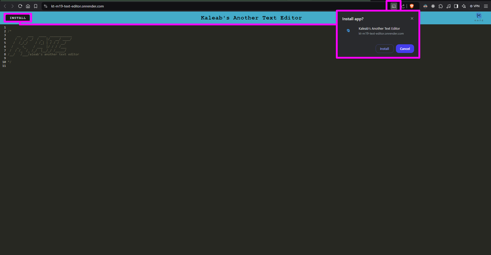
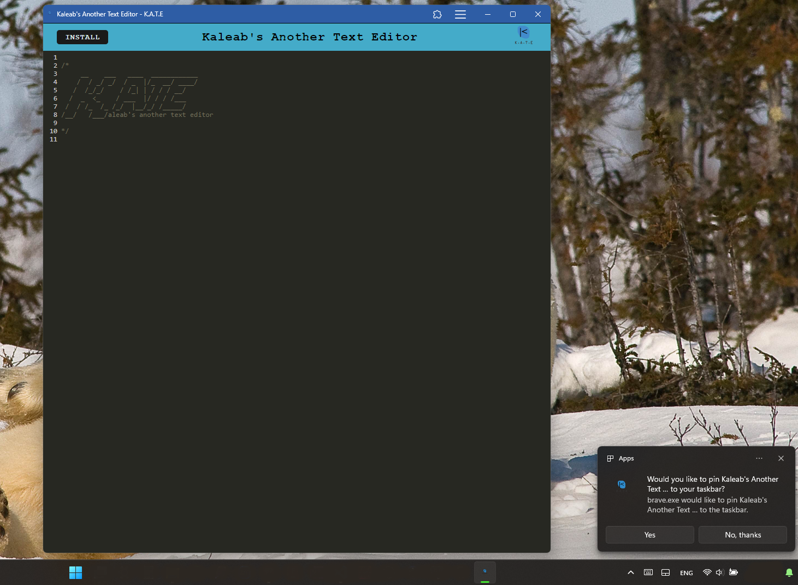
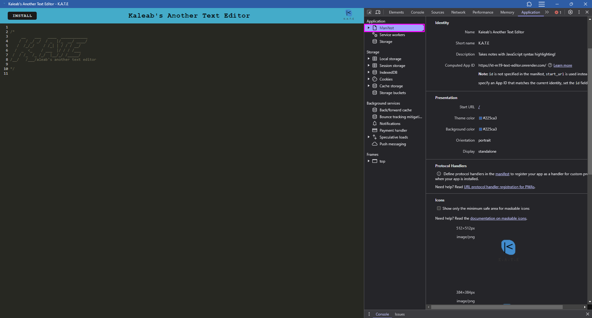

  

  

## **Kaleab's Another Text Editor**
   
    
                     __    ___   ____  ____________ 
                    /  / _/ _/  / _  |/_  __/ ____/
                   /  /_/_/    / /_| | / / / __/
                  /  _  <_    / ___  |/ / / /___
                 /  / /_  /_ /_/  |__/_/ /_____/
                /__/   /___/aleab's another text editor   

   
    
  
  

## Description
Kaleab's Another Text Editor (K.A.T.E) is a Progressive Web Application that takes notes with JavaScript syntax highlighting and can be installed as a native app on your computer.

## Deployed Application URL
https://kt-m19-text-editor.onrender.com

## Repository URL
https://github.com/Baelak/KT-M19-text-Editor

## Table of Contents
* [Features](#features)
* [Dependencies](#dependencies)
* [Languages and Technologies](#languages-and-technologies)
* [Screenshots](#Screenshots)
* [Contributors](#contributors)
* [Testing](#testing)
* [Questions](#questions)

## Features
One useful feature of this text editor is that it has a service worker that caches your progress and is saved on your browser so you are able to access your progress later on.

## Dependencies
Nodemon, Express, Workbox, Webpack

## Languages and Technologies:
**Javascript**, and **HTML** are the language used, while the technologies used  are **Node.js**, **Express.js**, and **Render**.

## Screenshots

## Contributors
None

## Testing
None

## Questions
Please send your questions [here](mailto:teklemichaelkaleab@gmail.com?subject=[GitHub]%20Dev%20Connect) or visit [github/Baelak](https://github.com/Baelak).
