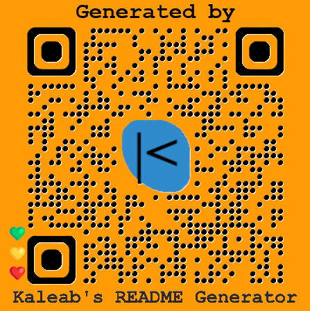

  

  

## **Kaleab's Another Text Editor**
   
        __   ___ ____  ____________
      /  / _/ _// _  |/_  __/ ____/
     /  /_/ _/ / /_| | / / / __/
    /     <|  / ___  |/ / / /___
   /  / \  \ /_/  |__/_/ /_____/
  /__/   \__\aleab's aNOTHER tEXT eDITOR 
  
  

## Description
This application is an API for a social network web app where users can share their thoughts, react to friends' thoughts, and create a friend list. It allows people to interact by adding friends, posting thoughts, and reacting to thought posts. They are able to create update and delete their accounts and thoughts, add and delete friends, and reactions.

## Application Walkthrough Video URL
https://drive.google.com/file/d/12TP1-jtd9xIAc-h0q6LhpvRQyYGBV4iD/view?usp=drive_link

## Repository URL
https://github.com/Baelak/KT-M18-social-Network-API

## Table of Contents
* [Features](#features)
* [Dependencies](#dependencies)
* [Languages and Technologies](#languages-and-technologies)
* [Screenshots](#Screenshots)
* [Contributors](#contributors)
* [Testing](#testing)
* [Questions](#questions)

## Features
One useful feature of the project is the virtual counter which counts the number of reactions and friends of a user.

## Dependencies
nodemon

## Languages and Technologies:
**Javascript** is the language used, while the technologies used  are **Node.js**, **Express.js**, **MongoDB**, **Mongoose**, and **Insomnia**.

## Screenshots

## Contributors
None

## Testing
None

## Questions
Please send your questions [here](mailto:teklemichaelkaleab@gmail.com?subject=[GitHub]%20Dev%20Connect) or visit [github/Baelak](https://github.com/Baelak).
